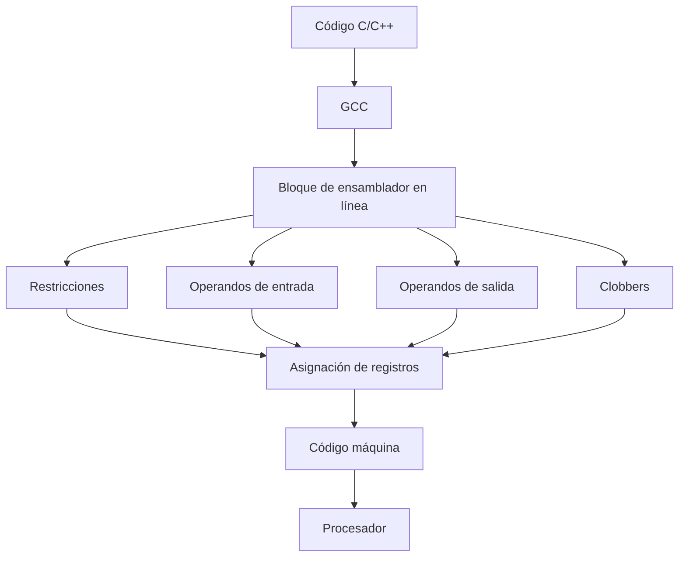
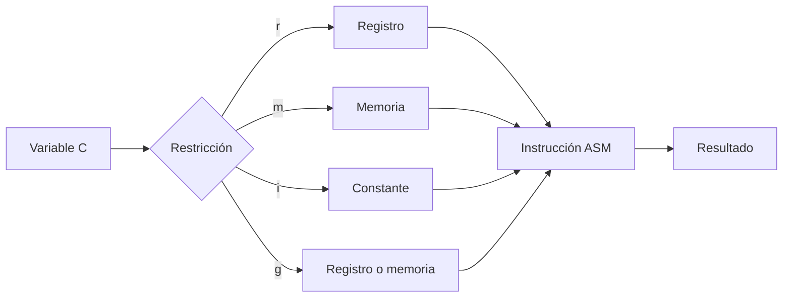
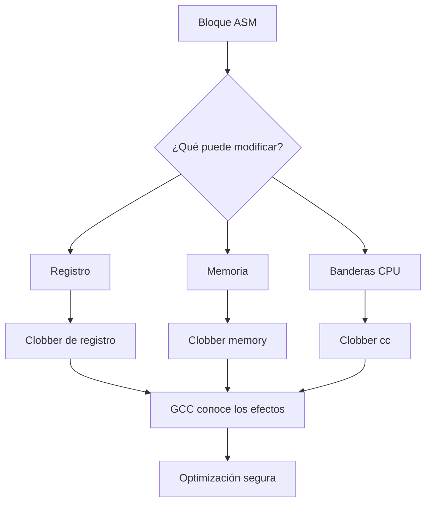
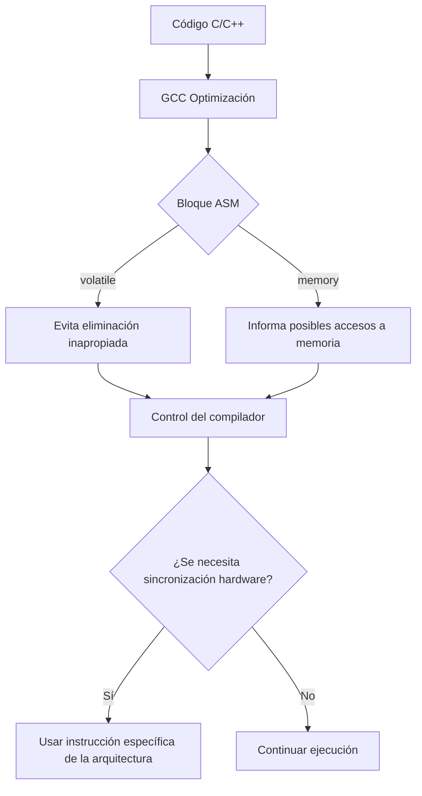
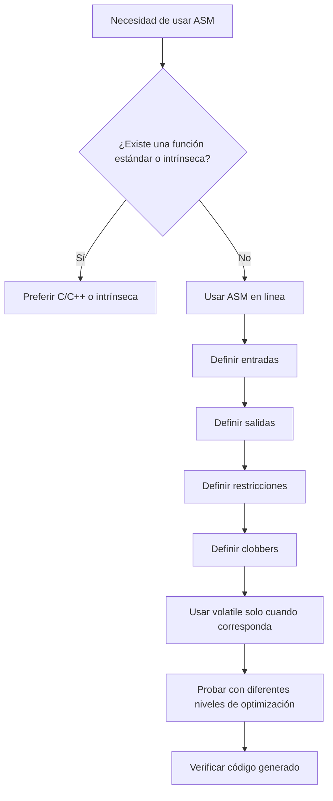
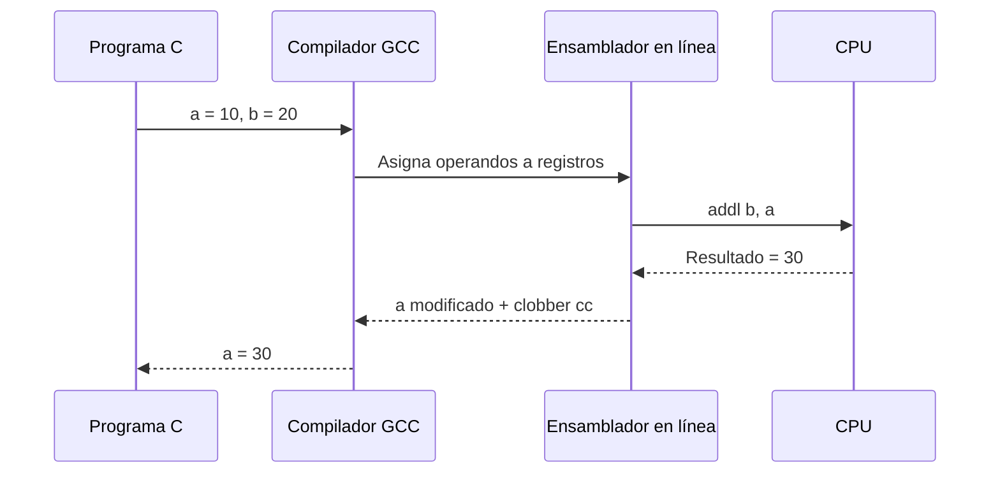

# Ensamblador en línea de GCC: restricciones, clobbers y buenas prácticas

## Introducción

El lenguaje ensamblador permite trabajar con instrucciones de bajo nivel que interactúan directamente con el procesador. Aunque normalmente los programas en C y C++ son compilados automáticamente por GCC hacia código máquina, existen situaciones en las que el programador necesita controlar una instrucción específica del procesador. Para estos casos, GCC proporciona una característica conocida como **ensamblador en línea** (*inline assembly*), mediante la cual es posible insertar instrucciones de ensamblador dentro del código fuente.

El ensamblador en línea de GCC es especialmente útil en programación de sistemas, desarrollo de controladores, sistemas embebidos, optimización de código y acceso a características específicas del hardware. Sin embargo, utilizarlo correctamente requiere conocer cómo GCC relaciona las instrucciones de ensamblador con las variables del programa y con el proceso de optimización del compilador.

Uno de los aspectos más importantes de esta característica son las **restricciones (*constraints*)**, que indican al compilador qué tipo de operandos puede utilizar una instrucción. También son fundamentales los **clobbers**, que permiten informar a GCC qué registros, memoria o condiciones del procesador pueden ser modificados por el bloque de ensamblador.

El objetivo de esta investigación es explicar de manera clara y técnica el funcionamiento del ensamblador en línea de GCC, haciendo énfasis en las restricciones, los clobbers y las buenas prácticas necesarias para utilizarlo de forma segura y eficiente.

---

# Desarrollo técnico

## 1. ¿Qué es el ensamblador en línea de GCC?

El ensamblador en línea permite escribir instrucciones de ensamblador directamente dentro de un programa en C o C++. GCC proporciona principalmente dos formas de utilizarlo: **asm básico** y **asm extendido**. Para realizar operaciones que interactúan con variables del programa normalmente se utiliza el ensamblador extendido.

La estructura general de un bloque de ensamblador extendido es:

```c
asm ("instrucciones"
     : operandos_de_salida
     : operandos_de_entrada
     : clobbers);
```

Cada sección cumple una función específica.

Los **operandos de salida** representan valores que serán producidos o modificados por el ensamblador. Los **operandos de entrada** proporcionan información desde el programa de C hacia la instrucción ensambladora. Finalmente, los **clobbers** indican recursos que pueden ser modificados indirectamente.

Por ejemplo:

```c
int resultado;
int a = 10;
int b = 20;

asm ("addl %2, %1\n\t"
     "movl %1, %0"
     : "=r"(resultado)
     : "r"(a), "r"(b));
```

En este ejemplo, GCC debe elegir registros adecuados para colocar `a`, `b` y `resultado`. La restricción `"r"` indica que el operando puede almacenarse en un registro de propósito general.

El beneficio principal es que GCC conserva información sobre las entradas y salidas del bloque, permitiéndole integrar el ensamblador con el resto del programa.

### Diagrama Mermaid



En resumen, el ensamblador en línea funciona como un puente entre un lenguaje de alto nivel y las instrucciones específicas del procesador. El programador escribe la operación, mientras que GCC utiliza las restricciones para decidir cómo debe integrarse dicha operación en el código generado.

---

## 2. Restricciones de operandos (*Constraints*)

Las restricciones son una de las partes más importantes del ensamblador extendido de GCC. Su función consiste en indicarle al compilador qué tipo de ubicación o formato necesita cada operando.

Entre las restricciones más utilizadas se encuentran:

| Restricción | Significado general |
|---|---|
| `r` | Registro de propósito general |
| `m` | Operando ubicado en memoria |
| `i` | Constante inmediata |
| `g` | Registro, memoria o constante |
| `a` | Registro específico `EAX/RAX` en x86 |
| `b` | Registro específico `EBX/RBX` en x86 |
| `c` | Registro `ECX/RCX` en x86 |
| `d` | Registro `EDX/RDX` en x86 |

Por ejemplo:

```c
int resultado;
int valor = 10;

asm ("movl %1, %0"
     : "=r"(resultado)
     : "r"(valor));
```

Aquí ambos operandos tienen la restricción `r`, por lo que GCC puede utilizar registros de propósito general.

Una restricción también puede contener modificadores. Por ejemplo:

```c
"=r"
```

indica que el operando es una **salida** que será escrita por el ensamblador.

Otro modificador importante es:

```c
"+r"
```

que indica que el operando es utilizado como entrada y posteriormente modificado como salida.

Ejemplo:

```c
int valor = 5;

asm ("addl $10, %0"
     : "+r"(valor));
```

Después de ejecutar el bloque, `valor` contiene el resultado de sumar 10.

Las restricciones permiten que GCC tenga libertad para utilizar diferentes registros, siempre que estos cumplan con los requisitos de la instrucción.

Esto es importante porque un bloque mal declarado puede producir errores difíciles de detectar. El ensamblador puede parecer correcto individualmente, pero si GCC no conoce correctamente las relaciones entre entradas y salidas, puede generar código incorrecto.

### Diagrama Mermaid



Por lo tanto, las restricciones no son simples etiquetas. Constituyen un contrato entre el programador y el compilador que especifica cómo debe proporcionarse y producirse cada operando.

---

## 3. Clobbers: informar al compilador qué se modifica

Los **clobbers** (*recursos destruidos o modificados*) permiten informar a GCC sobre recursos que son modificados por una instrucción de ensamblador, aunque dichos recursos no aparezcan directamente como operandos de salida.

Este mecanismo es especialmente importante cuando una instrucción modifica registros, memoria o indicadores de condición.

Un ejemplo típico es:

```c
asm volatile (
    "..."
    :
    :
    : "memory"
);
```

El clobber `"memory"` informa a GCC de que el ensamblador puede leer o modificar memoria que no aparece explícitamente en los operandos.

Es importante entender que:

```c
"memory"
```

**no significa que el procesador borre la memoria**. Es una indicación para el compilador que actúa como una barrera de optimización respecto al acceso a memoria.

También pueden declararse registros como clobbers. Por ejemplo:

```c
asm (
    "..."
    :
    :
    : "eax", "ecx"
);
```

Esto indica que el bloque de ensamblador modifica esos registros y que GCC no debe asumir que mantienen sus valores originales.

Otro clobber importante está relacionado con las **banderas o condiciones del procesador**:

```c
"cc"
```

Por ejemplo:

```c
asm (
    "addl %1, %0"
    : "+r"(a)
    : "r"(b)
    : "cc"
);
```

La instrucción `add` modifica las banderas del procesador, por lo que `"cc"` informa esta situación al compilador.

El uso correcto de los clobbers es fundamental porque GCC realiza numerosas optimizaciones. Si el programador modifica un recurso y no lo declara, GCC puede reutilizar información antigua y generar resultados incorrectos.

### Diagrama Mermaid



Los clobbers pueden considerarse una forma de comunicarle al compilador los **efectos secundarios** que no están representados directamente mediante los operandos.

---

## 4. `volatile`, memoria y sincronización con el compilador

La palabra clave `volatile` tiene un papel importante en algunos bloques de ensamblador en línea.

Por ejemplo:

```c
asm volatile ("nop");
```

El modificador `volatile` indica que el bloque ASM no debe eliminarse simplemente porque GCC determine que su resultado aparentemente no se utiliza.

Esto resulta importante en situaciones donde la instrucción tiene efectos que no son visibles mediante sus operandos.

Un ejemplo podría ser una instrucción utilizada para acceder a un dispositivo de hardware o producir un efecto temporal específico:

```c
asm volatile ("nop");
```

Sin embargo, `volatile` no significa que el compilador deje de optimizar todo el programa. Tampoco equivale automáticamente a una barrera completa de memoria para el procesador.

Para comunicar al compilador que el ensamblador puede afectar a memoria se puede utilizar:

```c
: : : "memory"
```

Un ejemplo:

```c
asm volatile (
    "..."
    :
    :
    : "memory"
);
```

Aquí se combinan dos conceptos diferentes:

- `volatile`: evita que GCC elimine o mueva libremente el bloque bajo ciertas reglas de optimización.
- `"memory"`: informa al compilador de que el bloque puede acceder a memoria no especificada mediante los operandos.

Es importante distinguir también una **barrera del compilador** de una **barrera de memoria de hardware**. Una barrera del compilador controla cómo GCC reorganiza operaciones durante la compilación. Una barrera de hardware, en cambio, depende de instrucciones específicas de la arquitectura del procesador y controla el comportamiento de las operaciones de memoria respecto a otros procesadores o dispositivos.

Por ello, utilizar simplemente `"memory"` no debe interpretarse como una instrucción universal de sincronización entre núcleos.

### Diagrama Mermaid



La idea principal es no utilizar `volatile` ni `"memory"` de manera automática. Deben utilizarse cuando realmente representan el comportamiento de la instrucción.

---

## 5. Buenas prácticas y errores frecuentes

El ensamblador en línea de GCC debe utilizarse con cuidado porque introduce código dependiente de la arquitectura y puede dificultar la portabilidad y el mantenimiento.

Una de las mejores prácticas es utilizar **operandos en lugar de asumir registros manualmente** siempre que sea posible.

Por ejemplo, es preferible:

```c
asm (
    "addl %1, %0"
    : "+r"(a)
    : "r"(b)
);
```

en lugar de escribir código que dependa innecesariamente de un registro específico:

```c
asm (
    "movl %eax, %ebx"
);
```

El primer enfoque permite que GCC realice la asignación de registros y conozca la relación entre las variables y la instrucción.

Otra buena práctica consiste en declarar correctamente las salidas modificables mediante `+`.

Por ejemplo:

```c
asm (
    "addl %1, %0"
    : "+r"(a)
    : "r"(b)
);
```

La variable `a` entra al ensamblador con un valor inicial y sale modificada. Por eso debe declararse como entrada/salida.

También es importante declarar los clobbers cuando corresponda:

```c
asm (
    "addl %1, %0"
    : "+r"(a)
    : "r"(b)
    : "cc"
);
```

Aquí `"cc"` indica que las banderas del procesador son modificadas.

Otra recomendación consiste en mantener los bloques ASM **pequeños y específicos**. Cuanto más grande sea el bloque de ensamblador, más difícil será para el compilador optimizar el código y más difícil será para otra persona comprenderlo.

También debe considerarse la arquitectura. Un código diseñado para x86 puede no funcionar en ARM, RISC-V u otras arquitecturas.

### Errores frecuentes

#### Error 1: No declarar una salida correctamente

```c
asm ("movl $10, %0");
```

si no se declara correctamente el operando de salida, GCC no tiene una descripción adecuada del resultado.

Una forma correcta sería:

```c
int resultado;

asm (
    "movl $10, %0"
    : "=r"(resultado)
);
```

#### Error 2: Modificar un registro sin declararlo

```c
asm (
    "movl $100, %%eax"
);
```

Si el bloque modifica `eax` y no informa adecuadamente al compilador, pueden producirse conflictos con el código generado por GCC.

#### Error 3: Usar `"memory"` sin necesidad

No todos los bloques ASM requieren un clobber `"memory"`. Utilizarlo innecesariamente puede limitar las optimizaciones del compilador.

#### Error 4: Usar `volatile` por costumbre

`volatile` debe utilizarse cuando la instrucción realmente requiere que GCC preserve el bloque de acuerdo con las reglas de ASM volatile. No debe convertirse en una solución automática para cualquier problema de optimización.

#### Error 5: Escribir demasiado ensamblador

Cuando una operación puede realizarse fácilmente en C o mediante una función intrínseca proporcionada por el compilador, generalmente conviene evaluar esas alternativas antes de introducir ASM.

### Diagrama Mermaid



Una buena práctica adicional es probar el programa con diferentes niveles de optimización, por ejemplo:

```bash
gcc -O0 programa.c
gcc -O2 programa.c
gcc -O3 programa.c
```

Esto ayuda a detectar errores provocados por una declaración incorrecta de restricciones o clobbers.

También es recomendable inspeccionar el ensamblador producido por GCC:

```bash
gcc -S programa.c
```

De esta manera se puede comprobar si el compilador está generando las instrucciones esperadas.

---

# Ejemplo completo

A continuación se presenta un ejemplo sencillo de ensamblador en línea utilizando una operación de suma en x86:

```c
#include <stdio.h>

int main() {
    int a = 10;
    int b = 20;

    asm (
        "addl %1, %0"
        : "+r"(a)
        : "r"(b)
        : "cc"
    );

    printf("Resultado: %d\n", a);

    return 0;
}
```

El funcionamiento es el siguiente:

1. `a` contiene inicialmente `10`.
2. `b` contiene `20`.
3. `"+r"(a)` indica que `a` es una entrada y una salida.
4. `"r"(b)` indica que `b` debe colocarse en un registro.
5. `addl %1, %0` suma `b` a `a`.
6. `"cc"` indica que las banderas del procesador pueden cambiar.
7. El resultado final almacenado en `a` es `30`.

### Diagrama del ejemplo



---

# Conclusiones

El ensamblador en línea de GCC es una herramienta poderosa que permite combinar instrucciones de bajo nivel con programas desarrollados en C o C++. Su principal ventaja es que proporciona acceso directo a instrucciones y características específicas del procesador que no siempre pueden expresarse de forma sencilla mediante un lenguaje de alto nivel.

Sin embargo, utilizarlo correctamente requiere comprender la relación entre el código C, el compilador y el procesador. Las **restricciones** permiten especificar cómo deben manejarse los operandos, mientras que los **clobbers** informan a GCC sobre los recursos que pueden ser modificados durante la ejecución del ensamblador.

El uso de `volatile` también debe realizarse cuidadosamente, ya que tiene efectos relacionados con la optimización del compilador y no debe confundirse con una barrera de memoria hardware. De igual manera, el clobber `"memory"` sirve principalmente para comunicar al compilador posibles efectos sobre memoria y no representa por sí mismo una instrucción de sincronización del procesador.

Finalmente, las buenas prácticas son fundamentales para evitar errores. Se recomienda utilizar operandos y restricciones en lugar de depender innecesariamente de registros concretos, declarar correctamente entradas y salidas, especificar los clobbers adecuados, mantener pequeños los bloques de ensamblador y comprobar el código generado por GCC.

En conclusión, el ensamblador en línea debe utilizarse como una herramienta especializada. Cuando se emplea de manera correcta, puede proporcionar control y eficiencia a bajo nivel, pero un uso incorrecto puede producir errores difíciles de detectar, problemas de portabilidad y conflictos con las optimizaciones del compilador.

---

# Bibliografía

[1] Free Software Foundation, "Extended Asm," *Using the GNU Compiler Collection (GCC)*. [En línea]. Disponible en: https://gcc.gnu.org/onlinedocs/gcc/Extended-Asm.html

[2] Free Software Foundation, "Constraints for asm Operands," *Using the GNU Compiler Collection (GCC)*. [En línea]. Disponible en: https://gcc.gnu.org/onlinedocs/gcc/Constraints.html

[3] Free Software Foundation, "How to Use Inline Assembly Language in C Code," *GNU C Language Manual*. [En línea]. Disponible en: https://gcc.gnu.org/onlinedocs/gcc/Using-Assembly-Language-with-C.html

[4] Intel Corporation, *Intel 64 and IA-32 Architectures Software Developer's Manual*. Santa Clara, CA, USA: Intel Corporation. [En línea]. Disponible en: https://www.intel.com/content/www/us/en/developer/articles/technical/intel-sdm.html

[5] Free Software Foundation, "Volatile," *Using the GNU Compiler Collection (GCC)*. [En línea]. Disponible en: https://gcc.gnu.org/onlinedocs/gcc/Volatile.html

[6] R. Love, *Linux Kernel Development*, 3rd ed. Boston, MA, USA: Addison-Wesley, 2010.

[7] M. Kerrisk, *The Linux Programming Interface*. San Francisco, CA, USA: No Starch Press, 2010.
