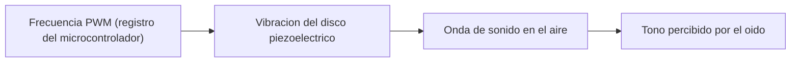
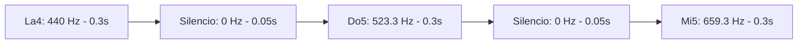
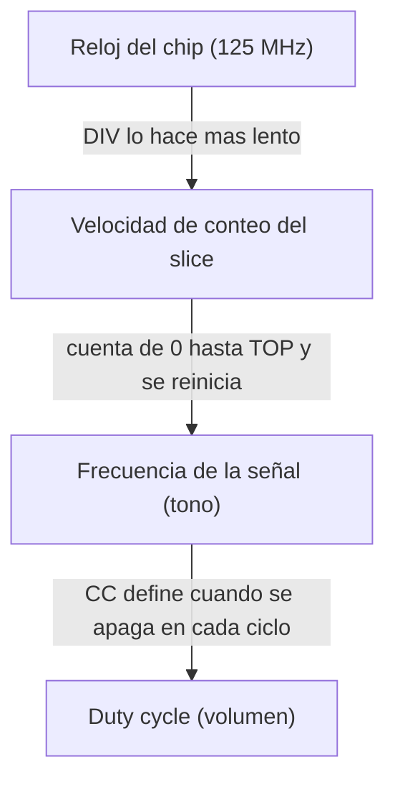
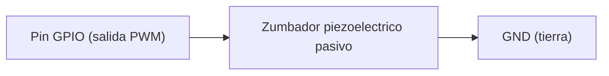
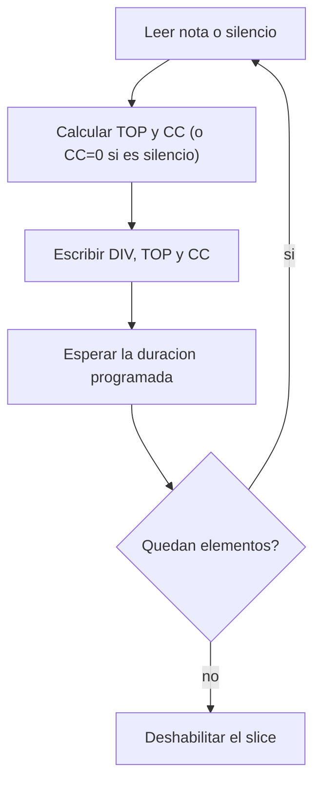

    

# Generación de tonos y melodías con PWM en un zumbador piezoeléctrico

## Introducción
Un microcontrolador se comunica con el mundo exterior (sensores, pantallas, zumbadores, entre otros) mediante periféricos, bloques de hardware que se exponen como registros de memoria y que el procesador configura con unas pocas escrituras, sin tener que generar él mismo cada señal eléctrica; el PWM es uno de esos periféricos, y aplicado sobre un zumbador piezoeléctrico permite controlar el tono de un sonido con solo cambiar la frecuencia programada en esos registros.

## Desarrollo Técnico

**Conceptos acústicos**

El sonido es, en su forma más simple, una vibración mecánica que se propaga por el aire y llega al oído como una sensación audible. Tres conceptos bastan para describir esa vibración.

- Frecuencia (f) - número de vibraciones completas por segundo (se mide en hertz).
- Periodo (T) - duración de una sola vibración completa (una vibración más corta implica más vibraciones por segundo, de ahí que f = 1/T).
- Tono - forma en que el oído percibe la frecuencia; una frecuencia alta se percibe como un tono agudo y una frecuencia baja como un tono grave, la misma relación que un microcontrolador aprovecha para controlar el tono de un zumbador cambiando la frecuencia de su señal PWM [1].

| Magnitud | ¿Qué es? | Relación |
|---|---|---|
| Frecuencia (f) | Vibraciones completas por segundo | f = 1/T |
| Periodo (T) | Duración de una vibración completa | T = 1/f |
| Tono | Percepción subjetiva de la frecuencia | A mayor f, tono más agudo |

*Tabla 1. Vocabulario acústico.*

**Piezoelectricidad**

La piezoelectricidad tiene dos manifestaciones opuestas, y conviene distinguirlas antes de centrarse en la que realmente hace sonar un zumbador.

- Efecto directo - al deformar mecánicamente el material (aplicarle presión o esfuerzo), este genera un voltaje medible en su superficie; es la base de sensores de presión, vibración y micrófonos piezoeléctricos.
- Efecto inverso (o converso) - al aplicar un voltaje al material, este se deforma mecánicamente; es el efecto que usan los actuadores y, en particular, el disco cerámico de un zumbador [2].

El zumbador emplea únicamente el efecto inverso (el microcontrolador aplica el voltaje y el disco responde deformándose), de modo que el efecto directo no vuelve a mencionarse más adelante. Cada vez que se aplica un voltaje al disco, este se deforma un poco (la carga eléctrica se transforma en movimiento); al retirarlo o invertirlo, el disco regresa o se deforma en sentido contrario, y repetir este ciclo muchas veces por segundo produce la vibración mecánica que después se convierte en sonido.

**Zumbador piezoeléctrico**

    

Un zumbador piezoeléctrico es, físicamente, un disco metálico delgado con una lámina cerámica piezoeléctrica adherida encima (el diafragma); no requiere partes móviles adicionales ni bobinas, a diferencia de un altavoz convencional. Existen dos tipos, según la presencia o ausencia de un oscilador interno; esta diferencia determina cuál de los dos permite variar el tono desde el microcontrolador (el otro solo puede encenderse o apagarse, a una frecuencia fija de fábrica).

| Tipo | Oscilador interno | Señal que necesita | Permite variar el tono |
|---|---|---|---|
| Activo | Sí | Voltaje constante (encendido/apagado) | No, el tono es fijo de fábrica |
| Pasivo | No | Señal PWM de frecuencia variable | Sí |

*Tabla 2. Zumbador activo y pasivo [3].*

La cadena completa de conversión de energía puede resumirse en una sola frase, el microcontrolador entrega energía eléctrica variable (PWM), el disco piezoeléctrico la convierte en energía mecánica (flexión, por el efecto inverso), y esa flexión repetida convierte la energía mecánica en energía acústica (la onda de sonido que llega al oído) [4].

**PWM (señal que controla el zumbador)**

El PWM (modulación por ancho de pulso) es una señal que se prende y se apaga muy rápido, una y otra vez, dentro de un tiempo fijo llamado período (T). La parte de ese período en la que la señal se queda "prendida" se llama "duty cycle". En un zumbador piezoeléctrico, el período es el que controla el tono (qué tan agudo o grave suena), mientras que el duty cycle solo controla el volumen (qué tan fuerte suena), sin afectar el tono [1]. Por eso normalmente se usa un duty cycle bajo, hasta un 50%. Dentro de un microcontrolador real, un contador automático genera esta señal usando dos valores que se programan. El primer valor le dice al contador cuándo reiniciarse, y eso define el período. El segundo valor le dice hasta dónde contar antes de apagar la señal, y eso define el duty cycle.

**Puente entre PWM y el sonido percibido**

La frecuencia que se programa en el periférico PWM se convierte, por efecto piezoeléctrico inverso, en la frecuencia de flexión mecánica del disco; esa flexión mecánica empuja el aire a la misma frecuencia, generando una onda sonora; y esa onda sonora, al llegar al oído, se percibe como un tono correspondiente exactamente a la frecuencia programada. El duty cycle, en cambio, no participa en esta cadena de frecuencia sino en el volumen o intensidad sonora que se percibe [1], [4].

*Diagrama 1. Flujo de la señal PWM al tono percibido.*

**Notas y melodías**

Para convertir una frecuencia en una nota musical basta un solo punto de referencia, normalmente se usa "La4" que equivale a 440 Hz [5]. Se usa esta nota como referencia porque es el estándar internacional de afinación musical (establecido formalmente en 1955 por la ISO) [6], de modo que prácticamente todos los instrumentos, equipos de audio y ejemplos de código parten de este mismo valor.

A partir de La4, el resto de las notas se puede obtener de dos formas:

- Si la nota está a una octava completa de distancia, basta con duplicar la frecuencia (si es una octava arriba) o dividirla entre dos (si es una octava abajo).
- Si la nota está a cualquier otra distancia, se necesita contar cuántos semitonos la separan de La4 y aplicar la fórmula general:

                                                        f = 440 × 2^(n/12)

    Donde `n` es el número de semitonos de distancia (positivo si la nota es más aguda que La4, negativo si es más grave), y 12 es la cantidad de semitonos que tiene una octava completa.

| Nota | Semitonos desde La4 |
|---|---:|
| La3 | -12 |
| Do4 | -9 |
| Mi4 | -5 |
| La4 | 0 |
| Do5 | +3 |
| Mi5 | +7 |
| La5 | +12 |

*Tabla 3. Distancia en semitonos de algunas notas respecto a La4.*

Aplicando la fórmula (o consultando una tabla de valores ya calculados) se obtienen las frecuencias necesarias para programar una melodía, sin tener que hacer el cálculo cada vez.

| Nota | Frecuencia (Hz) |
|---|---:|
| La3 | 220,0 |
| Do4 | 261,6 |
| Mi4 | 329,6 |
| La4 | 440,0 |
| Do5 | 523,3 |
| Mi5 | 659,3 |
| La5 | 880,0 |

*Tabla 4. Frecuencias de referencia para notas comunes.*

Una melodía no es más que una lista de elementos, donde cada elemento trae tres datos. La frecuencia de la nota (o cero, si es un silencio), su duración, y si corresponde a un silencio o a un sonido. Los silencios son necesarios entre notas para que la melodía no se escuche como un solo tono continuo.

*Diagrama 2. Ejemplo de una melodía sencilla como secuencia de notas y silencios.*

**Ejemplo de implementación en el RP2040**

La Raspberry Pi Pico es una placa pequeña que usa un chip llamado RP2040 para controlar todo el hardware conectado a ella. Los pines que sobresalen de la placa se llaman GPIO, y son los que se conectan a componentes como el zumbador.

    

El RP2040 no tiene un solo generador de señal PWM, tiene 8 generadores independientes llamados "slices", y cada slice puede producir 2 señales al mismo tiempo, llamadas "canal A" y "canal B". Cada pin GPIO ya tiene asignado, de fábrica, a qué slice y canal pertenece, siguiendo una fórmula fija. Por ejemplo, el GPIO 6 corresponde al slice 3, canal A.

| Elemento | ¿Cómo se calcula? | Ejemplo (GPIO 6) |
|---|---|---|
| Slice asociado | Se divide el número de pin entre 2 | slice 3 |
| Canal asociado | Se ve si el número de pin es par (canal A) o impar (canal B) | canal A |

*Tabla 5. Mapeo de un pin GPIO a su slice y canal PWM [7].*

Dentro de cada slice hay tres valores que se programan para generar la señal deseada:

- DIV - funciona como un freno, ya que hace que el contador interno cuente más lento (el reloj del chip corre muy rápido por sí solo).
- TOP - es el número hasta donde cuenta el slice antes de reiniciarse; define el período, y por lo tanto el tono.
- CC - es el número hasta donde llega el contador antes de apagar la señal dentro del mismo ciclo; define el duty cycle, y por lo tanto el volumen.

Estos tres valores se relacionan mediante la siguiente fórmula, que determina la frecuencia final de la señal PWM [7]:

                                                f_PWM = f_sys / (DIV × (TOP + 1))

Donde f_sys es la velocidad del reloj del chip (125 MHz, siempre fija). Con solo escribir DIV, TOP y CC, el hardware del chip genera la señal por sí solo, sin que el programador tenga que prender y apagar el pin manualmente.

*Diagrama 3. Cómo los valores DIV, TOP y CC generan la señal PWM.*

Conectar el zumbador solo requiere un cable que va del zumbador al pin GPIO configurado como salida PWM, y otro cable que va del zumbador a GND (tierra), sin necesitar ningún componente adicional.

*Diagrama 4. Conexión física mínima del zumbador al microcontrolador.*

**Cálculo del ejemplo anterior**

La tabla 6 resume el cálculo completo para pasar de "se quiere 440 Hz" a los tres números reales que se escriben en los registros del slice.

| Parámetro | Valor | ¿Cómo se obtiene? |
|---|---|---|
| f_sys | 125 MHz | Es fijo, siempre corre a esta velocidad |
| DIV | 5 | Se elige libremente, buscando que el cálculo sea manejable |
| TOP | 56817 | Se despeja de la fórmula del PWM, usando f_sys, DIV y la frecuencia deseada (440 Hz) |
| CC | 28408 | Se calcula como TOP entre 2, para lograr un duty cycle de 50% |

*Tabla 6. Cálculo numérico completo para generar 440 Hz [7].*

Es decir, la velocidad del reloj (f_sys) siempre es la misma, así que solo se elige un valor de DIV, y con eso se calcula el TOP necesario para lograr la frecuencia deseada. Una vez que se tiene el TOP, se calcula el CC dividiendo TOP entre 2.

Para reproducir una melodía completa, el firmware repite este mismo cálculo por cada nota o silencio de la melodía. Primero calcula el TOP correspondiente a esa frecuencia (o usa CC = 0 si es un silencio), después escribe los tres valores en los registros, y al final espera la duración indicada antes de pasar al siguiente elemento.

*Diagrama 5. Flujo completo para reproducir una melodía en el RP2040.*

**Aplicaciones**

- Alertas sonoras en electrodomésticos (microondas, lavadoras, ollas de cocción).
- Notificaciones y alarmas en dispositivos médicos portátiles (bombas de infusión, monitores de paciente).
- Señalización en electrónica automotriz (sensores de estacionamiento, recordatorios de cinturón).
- Tonos de confirmación o error en teclados y pequeños dispositivos electrónicos [4].

## Conclusión
Puedo decir que, para hacer sonar un zumbador piezoeléctrico no hace falta ningún circuito especial de audio, solo aprovechar una función que el microcontrolador ya trae integrada. Una vez que se programan unos pocos valores, el propio chip se encarga de mantener la señal por su cuenta, sin necesitar ayuda extra del procesador, lo cual lo hace ideal para proyectos pequeños y de bajo consumo, ya que se logra un buen resultado con muy poco hardware adicional y casi sin exigirle trabajo al procesador.

## Bibliografía

[1] mbedded.ninja, "Piezoelectric Speakers," *mbedded.ninja Electronics Notes*, 2012 (actualizado). [En línea]. Disponible: https://blog.mbedded.ninja/electronics/components/piezoelectric-speakers/

[2] Y. Meng, G. Chen, y M. Huang, "Piezoelectric Materials: Properties, Advancements, and Design Strategies for High-Temperature Applications," *Nanomaterials*, vol. 12, n.° 7, art. 1171, abr. 2022. [En línea]. Disponible: https://pmc.ncbi.nlm.nih.gov/articles/PMC9000841/

[3] K. Magdy, "Active Buzzer vs Passive Buzzer," *DeepBlueMbedded*, ago. 2023. [En línea]. Disponible: https://deepbluembedded.com/active-buzzer-vs-passive-buzzer/

[4] TDA Buzzer, "Piezoelectric Buzzer Guide: How It Works, Types & Drive Circuits," *TDA Buzzer Industry News*, 2025. [En línea]. Disponible: https://www.tda-buzzer.com/news/industry-news/piezoelectric-buzzer-guide-how-it-works-types-drive-circuits.html

[5] Dept. of Psychology, University of Washington, "Chapter 11: Sound and Pitch," notas del curso PSY 333, Seattle, WA, USA. [En línea]. Disponible: https://courses.washington.edu/psy333/lecture_pdfs/chapter11_SoundPitch.pdf

[6] F. Gribenski, "Plenty of pitches," *Nature Physics*, vol. 16, p. 232, 2020. [En línea]. Disponible: https://www.nature.com/articles/s41567-019-0707-1

[7] Raspberry Pi Ltd., *RP2040 Datasheet: A microcontroller by Raspberry Pi*, doc. RP-008371-DS. [En línea]. Disponible: https://pip.raspberrypi.com/documents/RP-008371-DS-rp2040-datasheet.pdf
