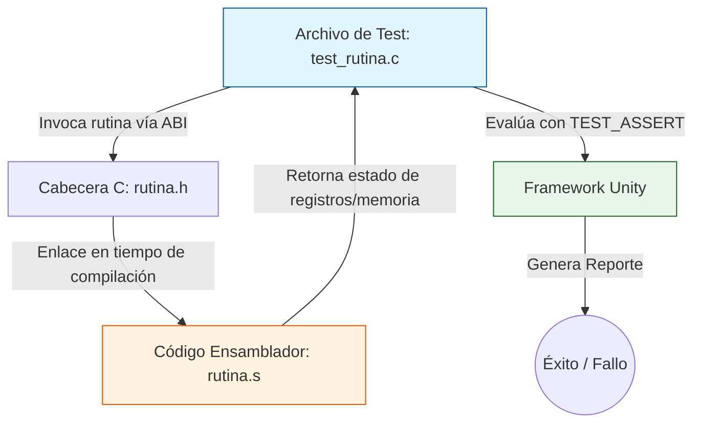
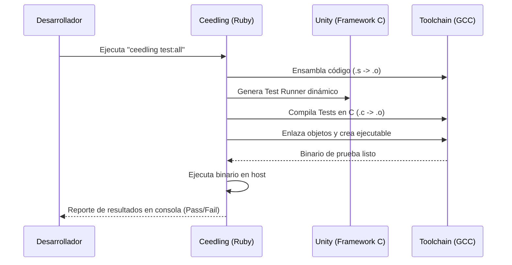

# Seguridad y calidad del código: Pruebas unitarias de código en ensamblador con Unity / Ceedling
* Nombre completo: Jose Alberto Velázquez Montiel
* Numero de control: 23212722
* Materia: Lenguajes de interfaz 3pm - 4pm
* Carrera: Ingenieria en sistemas computacionales
## Introducción

En el ámbito de la ingeniería de software, la seguridad y la calidad del código son pilares innegociables, especialmente cuando se trabaja en sistemas embebidos, controladores de hardware o componentes de misión crítica. En estos entornos, el lenguaje ensamblador sigue siendo indispensable para optimizar rutinas críticas, gestionar interrupciones o interactuar directamente con los registros del procesador. Sin embargo, su naturaleza de bajo nivel elimina las redes de seguridad que ofrecen lenguajes modernos (como la gestión de memoria automatizada o la verificación de tipos). 

Para mitigar los riesgos de vulnerabilidades, como los desbordamientos de búfer o la corrupción de la pila, es imperativo aplicar metodologías ágiles como el Desarrollo Guiado por Pruebas (TDD) y las pruebas unitarias. Aunque históricamente ha sido complejo probar código en ensamblador, herramientas como Unity y Ceedling han revolucionado este proceso, permitiendo integrar rutinas de bajo nivel en flujos de trabajo de integración continua, garantizando así un software robusto, predecible y seguro.

---

## Desarrollo: Pruebas Unitarias de Ensamblador con Unity y Ceedling

**1. La vulnerabilidad intrínseca del lenguaje ensamblador**
El código en ensamblador otorga un control absoluto sobre el hardware, pero delega toda la responsabilidad de la seguridad en el programador. Un simple error al manejar el puntero de la pila (`Stack Pointer`) o al no preservar el estado de un registro puede desencadenar fallos catastróficos que son extremadamente difíciles de depurar. Desde la perspectiva de la calidad del código, las rutinas no probadas son cajas negras propensas a introducir regresiones que comprometen la integridad del sistema.

**2. El framework Unity y el sistema Ceedling**
Unity es un framework de pruebas unitarias ligero diseñado específicamente para el lenguaje C, ideal para sistemas con recursos limitados. Por su parte, Ceedling es un sistema de construcción (escrito en Ruby) que envuelve a Unity y a CMock. Automáticamente genera *runners* de pruebas, compila los archivos, enlaza los objetos y ejecuta los tests. Aunque están diseñados para C, su capacidad para interactuar con la cadena de herramientas del compilador (como GCC en entornos Linux o distribuciones como Ubuntu y Fedora) permite probar código en ensamblador de manera completamente transparente.

**3. La interfaz entre C y Ensamblador (ABI)**
Para probar rutinas de ensamblador con Unity, se utiliza un enfoque de interoperabilidad. No se escriben las pruebas en ensamblador; se escriben en C. Esto es posible gracias a la Interfaz Binaria de Aplicaciones (ABI, por sus siglas en inglés), que dicta cómo se pasan los argumentos a las funciones y cómo se devuelven los valores a través de los registros del procesador. Al declarar el prototipo de la función en ensamblador dentro de un archivo de cabecera (`.h`) en C, Unity puede invocar la rutina de bajo nivel como si fuera una función nativa de C.

### Arquitectura de Interacción (C - Ensamblador)

**4. Implementación práctica del entorno de pruebas**
El flujo de trabajo con Ceedling consta de los siguientes pasos automatizados que facilitan la integración continua:
* **Creación de la rutina:** Se escribe el código fuente en ensamblador (por ejemplo, un archivo `.s` o `.asm`) asegurándose de exportar globalmente el nombre de la función (ej. `.global mi_rutina_asm`).
* **Declaración:** Se crea un archivo `.h` en C que expone la firma de la función.
* **Escritura del test:** Se utiliza Unity para crear un archivo `test_mi_rutina.c`. Aquí se configuran las precondiciones usando `setUp()`, se llama a la función en ensamblador y se validan los resultados utilizando macros de aserción como `TEST_ASSERT_EQUAL_INT32()`.
* **Compilación y ejecución:** Ceedling invoca el ensamblador para convertir el `.s` en código objeto, compila los tests en C y enlaza todo en un ejecutable de prueba.

### Flujo de Integración Continua con Ceedling

**5. Impacto en la seguridad y calidad**
Automatizar las pruebas de ensamblador con Ceedling eleva drásticamente la seguridad del sistema. Permite inyectar vectores de ataque conocidos (como valores extremos o punteros nulos) desde el entorno controlado de C hacia las rutinas de ensamblador para verificar que no colapsen (evitando *buffer overflows*). Además, garantiza que cualquier refactorización o ciclo de optimización de ciclos de reloj en el futuro no rompa la funcionalidad original, cumpliendo con los estándares de calidad más rigurosos.

---

## Conclusiones

La programación en ensamblador ya no tiene que ser sinónimo de código oscuro, frágil e inescalable. La adopción de frameworks como Unity y herramientas de orquestación como Ceedling demuestra que las mejores prácticas de la ingeniería de software moderna pueden y deben aplicarse al nivel más bajo del hardware. Al envolver las rutinas de ensamblador en un arnés de pruebas escrito en C, los desarrolladores pueden validar matemáticamente el comportamiento de los registros y la memoria, previniendo vulnerabilidades críticas antes de que lleguen a producción. En última instancia, asegurar la calidad del código de bajo nivel mediante pruebas automatizadas es una inversión directa en la estabilidad, la ciberseguridad y la vida útil del sistema en su conjunto.

---

## Bibliografía

* Caba, J., Rincón, F., Barba, J., De La Torre, J. A., Dondo, J., & López, J. C. (2021). Towards Test-Driven Development for FPGA-Based Modules Across Abstraction Levels. *IEEE Access*, 9, 31581-31594. https://doi.org/10.1109/access.2021.3059941
* Grenning, J. W. (2011). *Test-Driven Development for Embedded C*. Pragmatic Bookshelf. https://pragprog.com/titles/jgade/test-driven-development-for-embedded-c/
* Mertech. (2024). *Test Driven Development for Embedded C*. Recuperado de https://chatbot.mertech.com/publication/jbBbMz1AD038/Test-Driven-Development-For-Embedded_C
* ThrowTheSwitch. (2023). *Ceedling Documentation*. ThrowTheSwitch.org. Recuperado de http://www.throwtheswitch.org/ceedling
* ThrowTheSwitch. (2023). *Unity - C Framework para Pruebas Unitarias*. ThrowTheSwitch.org. Recuperado de http://www.throwtheswitch.org/unity
