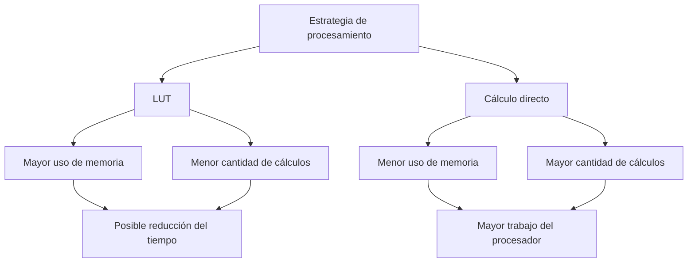
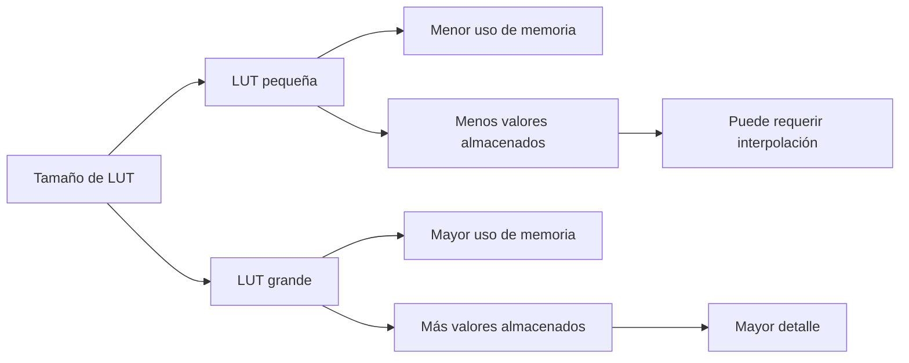
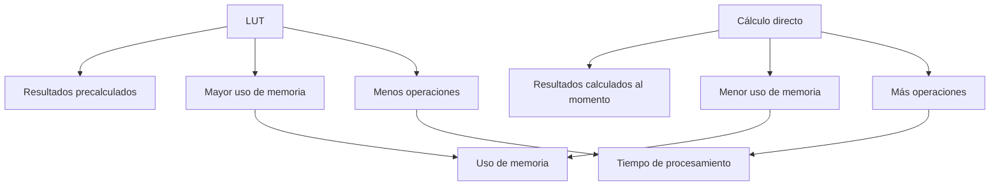
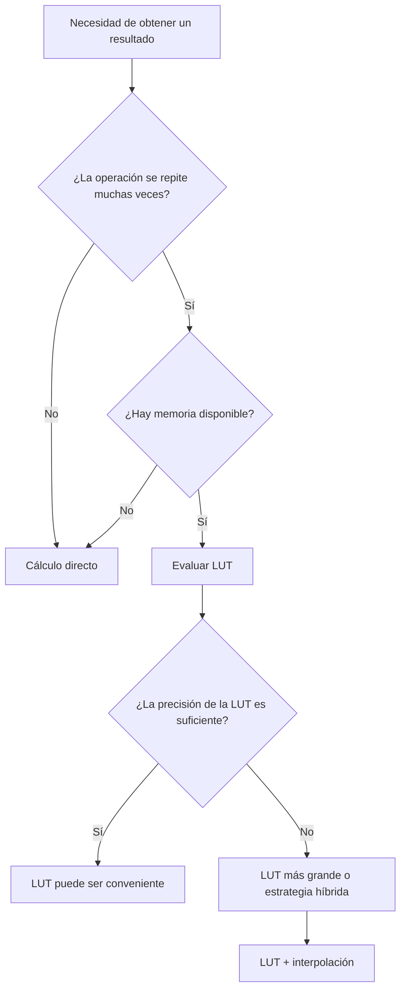
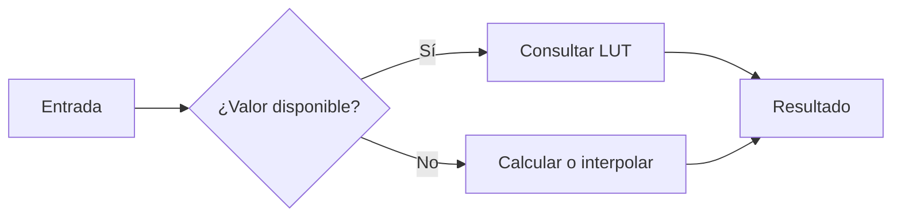

# Tablas de búsqueda (LUT) frente a cálculo directo: compromiso memoria–tiempo

> **Tema:** Tablas de búsqueda (LUT) frente a cálculo directo
> **Concepto central:** Compromiso memoria–tiempo
> **Área:** Computación, arquitectura de computadores y optimización

---

## 📑 Contenido

1. [¿Qué es una tabla de búsqueda (LUT)?](#1-qué-es-una-tabla-de-búsqueda-lut)
2. [¿Qué es el cálculo directo?](#2-qué-es-el-cálculo-directo)
3. [El compromiso memoria–tiempo](#3-el-compromiso-memoria-tiempo)
4. [Tamaño, precisión y memoria caché](#4-tamaño-precisión-y-memoria-caché)
5. [LUT frente a cálculo directo](#5-lut-frente-a-cálculo-directo)
6. [¿Cuándo utilizar cada alternativa?](#6-cuándo-utilizar-cada-alternativa)

---

# 1. ¿Qué es una tabla de búsqueda (LUT)?

Una **tabla de búsqueda**, conocida como **LUT (Look-Up Table)**, es una estructura de datos que almacena previamente resultados que pueden necesitarse durante la ejecución de un programa.

En lugar de realizar una operación cada vez que se necesita un resultado, el sistema puede consultar un valor que ya fue calculado y almacenado.

Por ejemplo, una función matemática como:

$$
f(x)=\sin(x)
$$

puede tener algunos de sus resultados calculados previamente:

| Entrada | Resultado |
| ------: | --------: |
|      0° |     0.000 |
|     30° |     0.500 |
|     45° |     0.707 |
|     60° |     0.866 |
|     90° |     1.000 |

Si posteriormente se necesita `sin(45°)`, el sistema puede consultar directamente el valor almacenado en la tabla.

### Funcionamiento de una LUT


El proceso puede entenderse en cuatro pasos:

1. Se recibe una entrada.
2. La entrada se utiliza para localizar una posición dentro de la tabla.
3. Se recupera el resultado almacenado.
4. El resultado se entrega al programa.

La principal ventaja es que se evita repetir una operación que ya fue realizada previamente.

> **Una LUT utiliza memoria para reducir la cantidad de cálculos necesarios durante la ejecución.**

Las LUT resultan especialmente útiles cuando una operación costosa se repite muchas veces y los posibles resultados pueden almacenarse de manera anticipada.

---

# 2. ¿Qué es el cálculo directo?

El **cálculo directo** consiste en obtener un resultado realizando las operaciones correspondientes cada vez que se necesita, sin almacenar previamente todos los resultados posibles.

Por ejemplo, para la expresión:

$$
y=x^2+3x+2
$$

si:

$$
x=5
$$

entonces:

$$
y=(5)^2+3(5)+2
$$

$$
y=25+15+2
$$

$$
y=42
$$

En este caso, el sistema realiza las operaciones cuando recibe el valor de entrada.

### Funcionamiento del cálculo directo


A diferencia de una LUT, no es necesario almacenar previamente todos los resultados posibles.

Esto reduce el uso de memoria, pero el procesador debe realizar nuevamente las operaciones cada vez que se necesita un resultado.

> **El cálculo directo utiliza procesamiento para reducir la necesidad de almacenar resultados previamente calculados.**

Por ejemplo, si una función necesita calcularse con valores diferentes cada vez, puede ser poco práctico construir una LUT que contenga todos los resultados posibles.

---

# 3. El compromiso memoria–tiempo

El concepto principal de este tema es el **compromiso memoria–tiempo**.

Una LUT permite reducir el tiempo necesario para obtener un resultado porque este fue calculado previamente. Sin embargo, los resultados deben almacenarse en memoria.

El cálculo directo utiliza menos memoria, pero necesita realizar las operaciones cada vez que se solicita un resultado.

### Relación entre memoria y tiempo



La relación puede resumirse de la siguiente manera:

| Estrategia          | Uso de memoria | Trabajo de cálculo |
| ------------------- | -------------- | ------------------ |
| **LUT**             | Mayor          | Menor              |
| **Cálculo directo** | Menor          | Mayor              |
| **Híbrida**         | Intermedio     | Intermedio         |

La idea fundamental puede expresarse como:

$$
\boxed{\text{LUT} \rightarrow \text{más memoria a cambio de menos cálculo}}
$$

$$
\boxed{\text{Cálculo directo} \rightarrow \text{menos memoria a cambio de más cálculo}}
$$

Este intercambio constituye el **compromiso memoria–tiempo**.

Sin embargo, esto no significa que una LUT siempre sea más rápida. El acceso a memoria también tiene un costo y una tabla demasiado grande puede generar accesos menos eficientes.

Por lo tanto, el objetivo no es simplemente utilizar la mayor cantidad posible de memoria, sino encontrar un equilibrio adecuado entre:

* Memoria disponible.
* Tiempo de procesamiento.
* Velocidad de acceso a memoria.
* Cantidad de operaciones.
* Precisión requerida.

---

# 4. Tamaño, precisión y memoria caché

El tamaño de una LUT influye directamente en la cantidad de memoria utilizada y en la precisión que puede obtenerse.

Una tabla pequeña requiere menos memoria, pero contiene menos valores. Una tabla grande puede almacenar más resultados y representar una función con mayor detalle, aunque requiere más espacio.

### Relación entre tamaño y precisión



Por ejemplo, una tabla podría almacenar:

| Entrada | Resultado |
| ------: | --------: |
|      0° |     0.000 |
|     10° |     0.174 |
|     20° |     0.342 |
|     30° |     0.500 |

Si se necesita el valor correspondiente a `15°`, este no se encuentra directamente en la tabla.

Una posibilidad es utilizar los valores cercanos y realizar una **interpolación**.

La interpolación lineal puede expresarse como:

$$
f(x)\approx f(x_1)+
\frac{x-x_1}{x_2-x_1}
[f(x_2)-f(x_1)]
$$

Esto permite utilizar una LUT relativamente pequeña sin tener que almacenar todos los valores posibles.

### Memoria caché

La memoria caché también influye en el rendimiento de una LUT.

Una tabla pequeña puede mantenerse en niveles rápidos de memoria y ser consultada frecuentemente con un costo reducido.

Una tabla demasiado grande puede superar la capacidad disponible en determinados niveles de caché, haciendo que algunos accesos deban realizarse en niveles de memoria más lentos.

Por esta razón:

> **Una LUT más grande no necesariamente significa una ejecución más rápida.**

El tamaño adecuado depende de la precisión requerida, la frecuencia de utilización y las características de la arquitectura del sistema.

---

# 5. LUT frente a cálculo directo

Las LUT y el cálculo directo permiten obtener resultados, pero utilizan los recursos del sistema de diferentes maneras.

### Comparación visual



La comparación general es:

| Característica                   | LUT                     | Cálculo directo       |
| -------------------------------- | ----------------------- | --------------------- |
| Uso de memoria                   | Alto                    | Bajo                  |
| Operaciones durante la ejecución | Menos                   | Más                   |
| Resultados precalculados         | Sí                      | No                    |
| Dependencia de memoria           | Mayor                   | Menor                 |
| Tiempo de cálculo                | Generalmente menor      | Generalmente mayor    |
| Precisión                        | Depende de la tabla     | Depende del algoritmo |
| Conveniencia                     | Operaciones repetitivas | Operaciones variables |

### Ejemplo práctico

Supóngase que un sistema necesita obtener una función millones de veces.

Con cálculo directo:

```text
Entrada
   ↓
Realizar cálculo
   ↓
Resultado
   ↓
Repetir operación
```

Con una LUT:

```text
Entrada
   ↓
Consultar tabla
   ↓
Resultado
   ↓
Repetir consulta
```

Si la operación es costosa y los valores de entrada se repiten frecuentemente, una LUT puede disminuir considerablemente el trabajo computacional.

En cambio, si las entradas son muy variadas y casi nunca se reutilizan los resultados, almacenar una gran cantidad de valores puede resultar poco conveniente.

---

# 6. ¿Cuándo utilizar una LUT y cuándo utilizar cálculo directo?

No existe una alternativa que sea mejor en todos los casos. La decisión depende de las características del problema y de los recursos disponibles.

### Proceso de decisión



### Una LUT puede ser conveniente cuando:

* La misma operación se ejecuta muchas veces.
* Los posibles valores de entrada son conocidos o limitados.
* Existe suficiente memoria disponible.
* El tiempo de procesamiento es una prioridad.
* Los resultados pueden reutilizarse.
* La precisión de los valores almacenados es suficiente.

### El cálculo directo puede ser conveniente cuando:

* Los valores de entrada son muy variados.
* La operación no representa un costo elevado.
* Existe poca memoria disponible.
* Los resultados no se reutilizan frecuentemente.
* Se necesita calcular cada resultado directamente.
* Una LUT tendría que ser demasiado grande.

### Estrategia híbrida

También puede utilizarse una estrategia híbrida.

En este caso, una LUT almacena algunos valores y el cálculo directo o la interpolación obtiene los valores que no se encuentran almacenados.



Esta estrategia puede reducir el tamaño de la tabla y, al mismo tiempo, conservar parte de las ventajas de las LUT.

---

# Conclusión

Las **tablas de búsqueda (LUT)** y el **cálculo directo** representan dos estrategias diferentes para obtener resultados durante la ejecución de un sistema.

La LUT permite reducir el trabajo de cálculo mediante el almacenamiento previo de resultados. Su principal costo es el consumo de memoria y el acceso a ella.

El cálculo directo reduce la necesidad de almacenamiento, pero requiere que las operaciones se realicen cada vez que se necesita un resultado.

El concepto fundamental puede resumirse mediante las siguientes relaciones:

$$
\boxed{\text{LUT} = \text{memoria a cambio de tiempo}}
$$

$$
\boxed{\text{Cálculo directo} = \text{tiempo a cambio de memoria}}
$$

La decisión depende de factores como:

**memoria disponible + tiempo de ejecución + precisión + frecuencia de uso + comportamiento de la memoria caché.**

Por lo tanto, optimizar un sistema no consiste simplemente en elegir entre LUT o cálculo directo, sino en determinar qué combinación permite utilizar de manera eficiente los recursos disponibles.

Cuando una operación costosa se repite constantemente, una LUT puede disminuir el trabajo del procesador. Cuando los valores de entrada son muy variados o la memoria disponible es limitada, el cálculo directo puede ser una alternativa más conveniente.

En algunos casos, una **estrategia híbrida** permite combinar ambas técnicas mediante una LUT pequeña complementada con cálculo directo o interpolación.

En términos generales, el compromiso puede resumirse así:

```text
                 COMPROMISO MEMORIA–TIEMPO

       LUT                              Cálculo directo
        │                                      │
        ▼                                      ▼
  Más memoria                              Menos memoria
        │                                      │
        ▼                                      ▼
 Menos cálculos                            Más cálculos
        │                                      │
        ▼                                      ▼
 Menor trabajo                            Mayor trabajo
 computacional                             computacional
```

La elección adecuada depende del problema que se está resolviendo y del recurso que tenga mayor importancia: **memoria, tiempo de procesamiento o equilibrio entre ambos**.

## Bibliografía

1. GitHub Docs. *Creación de diagramas*.  
   https://docs.github.com/es/get-started/writing-on-github/working-with-advanced-formatting/creating-diagrams

2. Intel. *Lookup Table (LUT)*. Intel FPGA Optimization Guide.  
   https://www.intel.com/content/www/us/en/docs/oneapi-fpga-add-on/optimization-guide/2023-2/lookup-table-lut.html

3. NVIDIA Developer. *Using Lookup Tables to Accelerate Color Transformations*. GPU Gems 2, Chapter 24.  
   https://developer.nvidia.com/gpugems/gpugems2/part-iii-high-quality-rendering/chapter-24-using-lookup-tables-accelerate-color

4. MIT OpenCourseWare. *The Memory Hierarchy*.  
   https://ocw.mit.edu/courses/6-004-computation-structures-spring-2009/resources/mit6_004s09_lec15/

5. MIT OpenCourseWare. *Caching and Cache-Efficient Algorithms*.  
   https://www.ocw.mit.edu/courses/6-172-performance-engineering-of-software-systems-fall-2018/7d9bd2d2b309a0c7d07011d1fe1f9302_xDKnMXtZKq8.pdf

6. Intel. *LookUp Tables (LUT) and Intel Graphics FAQ*.  
   https://www.intel.com/content/www/us/en/support/articles/000028999/graphics.html
