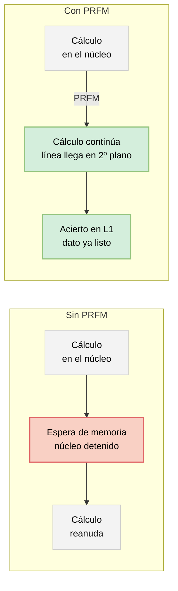

# Instrucciones de precarga (PRFM) para ocultar la latencia de memoria

## Introducción
En la actualidad tecnológica, a la hora de realizar el diseño de microprocesadores modernos, muy comúnmente se suele enfrentar a un desafío fundamental conocido como el muro de memoria (*memory wall*), un cuello de botella caracterizado por la creciente diferencia entre la velocidad de ejecución y la latencia de acceso a la memoria principal. Precisamente para solucionar esta limitación, la arquitectura ARMv8 anticipa los datos que un programa va a necesitar antes de que los pida, para esto incorpora instrucciones explícitas de precarga gestionadas por software, donde destaca la directiva **PRFM** (*Prefetch Memory*). 

Esta instrucción permite a compiladores y desarrolladores anticipar patrones de acceso irregulares, para el traslado de datos hacia la jerarquía de caché antes de su demanda. PRFM es una instrucción de pista (*hint*) lo que significa que no carga ningún valor en un registro ni cambia el resultado del programa; solo le avisa al sistema de memoria que una dirección se usará pronto, para que el dato quede disponible en caché cuando la carga o escritura real llegue. 

Este trabajo reúne evidencia del manual técnico oficial del núcleo Arm Neoverse V2 y de otros tres artículos de investigación, además de documentación sacada de la página oficial de Arm para explicar cómo PRFM oculta la latencia, qué variantes existen, cuánto rendimiento aporta en la práctica y cuáles son sus límites frente a patrones de acceso irregulares.

## Desarrollo técnico

### 1. Mecanismo
El manual técnico del núcleo Arm Neoverse V2 (TRM) resume el objetivo de PRFM de la siguiente manera: "la precarga de datos mejora el rendimiento al traer los datos antes de que se necesiten". Al ejecutarse, PRFM hace una búsqueda en la caché, si esta falla y la dirección es cacheable, arranca un *linefill* (una petición de línea completa a un nivel inferior de memoria). Lo importante es que la instrucción termina, desde el punto de vista del núcleo en cuanto ese *linefill* arranca, sin esperar a que se complete. Ese es justamente el efecto que se ilustra en el siguiente esquema: el mismo intervalo de tiempo que en la fila superior aparece como un bloqueo del núcleo se convierte, en la fila inferior, en cómputo útil que se solapa con la búsqueda del dato en segundo plano.

*(Esquema: Comparativa de ejecución. Rojo representa bloqueo por memoria, verde representa espera oculta / cómputo).*

Además, PRFM no altera el estado arquitectónico de los registros de propósito general, ni desencadena excepciones de fallo de memoria (*faults*) si la dirección objetivo resulta ser inválida. En el compilador de OCaml sus intrínsecos de precarga generan un `prefetcht0` en x86 y un `prfm pldl1keep` en su equivalente de AArch64, y si aparece un fallo de dirección ambos simplemente se ignoran. Esa doble propiedad conocida por ser no bloqueante y no generadora de fallos, es lo que permite insertar PRFM de forma especulativa, incluso sobre direcciones que el programador solo predice que se usarán, sin arriesgar la corrección del programa.

### 2. Sintaxis o anatomía de la instrucción
La sintaxis base en ensamblador AArch64 se estructura como: 

`PRFM (prfop | #imm5), [Xn|SP{, #pimm}]`

*   **PRFM**: Es el mnemónico de la instrucción (*Prefetch Memory*).
*   **prfop**: Es la llamada operación de prefinanciamiento o *prefetch* (define el tipo de acceso como `PLD` para carga, `PLI` para instrucciones o `PST` para almacenamiento, además del nivel de caché y la política).
*   **imm5**: Es el valor inmediato de 5 bits (rango de 0 a 31) usado para codificaciones de operación que no son accesibles directamente mediante *prfop*.
*   **Xn**: Es el registro base de propósito general de 64 bits.
*   **SP**: Es el puntero de pila (*Stack Pointer*) de 64 bits que también puede actuar como registro base.
*   **pimm**: Es el desplazamiento inmediato positivo opcional aplicado a la dirección base.

El nombre de cada variante de PRFM codifica tres decisiones: 
1. Qué tipo de acceso se anticipa (`PLD` para una lectura, `PLI` para una instrucción, `PST` para una escritura).
2. En qué nivel de caché debe aterrizar el dato (L1, L2 o L3).
3. Qué política de retención aplicar (`KEEP`, si se espera reutilizarlo pronto, o `STRM`, si es un dato de un solo uso que conviene no desplace a otros datos útiles). 

En los documentos se habla de dos variantes: `PRFM PSTL1KEEP` en el TRM del Neoverse V2 y `prfm pldl1keep`, generada por el backend de OCaml para AArch64. El propio TRM señala además una excepción de diseño: la variante de precarga de instrucciones, `PLI`, siempre apunta al nivel L2 y se ejecuta en segundo plano, sin que el software pueda elegir otro nivel. Para cargas vectoriales, ARM también dispone de una familia de precarga vectorizada (`PRF*`), capaz de anticipar varios accesos con una sola instrucción y mayor paralelismo de datos.

### 3. Ejemplo medido: cuánto rendimiento aporta en la práctica
La evidencia más completa proviene del compilador Ocamlopt, que añade primitivas de precarga al lenguaje OCaml y las traduce, para AArch64, a instrucciones PRFM. Se pueden insertar en operaciones tan comunes como recorrer listas o arreglos, en `Array.fold_left`, por ejemplo, se precarga con 16 iteraciones de antelación tanto el elemento que se leerá como el índice que lo localiza y miden el efecto en tres procesadores, incluido un Arm Cortex-A53 en orden:

| Sistema | Tipo de núcleo | Instrucción generada | Mejora geomedia (banco de pruebas de memoria) |
| :--- | :--- | :--- | :--- |
| **Intel Haswell** | Superescalar, fuera de orden agresivo | `prefetcht0` (x86) | 11,5% |
| **Arm Cortex-A53** | Superescalar, en orden | `prfm pldl1keep` (PRFM) | 28% |
| **Intel Xeon Phi (KNL)** | Superescalar, fuera de orden ligero | `prefetcht0` (x86) | 20% |

*(Con picos puntuales de hasta 2,1x en ese mismo banco de pruebas y de hasta 3x en el conjunto completo de experimentos sobre el A53, frente a un máximo de 2x en Haswell y KNL.)*

El dato más importante es que la ganancia relativa es mayor justo en el núcleo en orden: al no existir ejecución fuera de orden donde coincidan automáticamente varios fallos de caché, ocultar la latencia depende casi siempre de la precarga insertada por software. En un caso extremo como recorrer una lista solo para ubicarse en ella, sin usar los datos que cuelga cada nodo (`List.nth`), una única PRFM por desplazamiento logra hasta 1,7x de aceleración, con resultados parecidos en los tres sistemas.

Ese beneficio depende del parámetro de la distancia de anticipación, o cuántas iteraciones antes de usar un dato se emite su PRFM. Si es demasiado pronto la línea puede desalojarse antes de usarse, demasiado tarde y el acceso real alcanza a la precarga y vuelve a bloquear al núcleo. El óptimo seria cercano a 16 elementos para arreglos, con una estabilidad razonable entre 8 y 64. El TRM del Neoverse V2 confirma que este fenómeno tiene visibilidad a nivel de hardware: su extensión de perfilado estadístico (SPE) incluye un bit dedicado, precarga tardía (bit 12, "Late prefetch"), que marca cada acceso muestreado cuya precarga no llegó a tiempo.

### 4. PRFM para acelerar atómicos
El TRM documenta un uso de PRFM que rara vez aparece en la literatura de precarga clásica. En el Neoverse V2, una instrucción atómica que no encuentra su línea en estado exclusivo en L1 puede resolverse como átomo cercano (ejecutado localmente tras un solo relleno de línea) o como átomo lejano (reenviado al interconector del sistema, con más latencia). El manual recomienda preceder la instrucción atómica con `PLDW` o con `PRFM PSTL1KEEP` cuando el software prefiere forzar el camino de átomo cercano. Es decir, PRFM no solo acelera una lectura o un recorrido de datos: también puede usarse para inclinar deliberadamente el protocolo de coherencia hacia la ruta más rápida antes de una sincronización entre hilos.

### 5. PRFM frente a PREFETCHW de x86
En cuanto a canales encubiertos PRFM se comporta como una pista de caché no coherente y no genera tráfico de coherencia entre núcleos ni cambia de forma visible el estado de la línea en la caché privada de otro núcleo. A diferencia de `PREFETCHW` en x86, que sí puede forzar una línea al estado *Modified* y producir una transición observable desde otro núcleo, por esa razón, su canal encubierto basado en coherencia no funciona sobre ARM TrustZone en configuración estándar. Leído en sentido inverso al de un atacante, esto confirma que PRFM oculta la latencia de forma más "silenciosa", sin dejar un efecto secundario observable en el resto del sistema.

### 6. PRFM y el prefetcher de hardware
PRFM convive con un *prefetcher* de hardware automático. En el Neoverse V2, la unidad de carga/almacenamiento incluye un motor que sigue direcciones virtuales y alimenta L1 y L2 para las lecturas, y otro basado en direcciones físicas que solo alimenta L2 para las escrituras. Este motor se ajusta mediante los registros `IMP_CPUECTLR_EL1` e `IMP_CPUECTLR2_EL1`, que exponen un interruptor global (`PF_DIS`), una distancia de anticipación configurable (22, 40 o 60 líneas, o modo dinámico) y un nivel de agresividad de 0 a 3. Para que ambos mecanismos no se confundan en las estadísticas, los eventos arquitectónicos del PMU como `L1D_CACHE` y `L1D_CACHE_REFILL` excluyen explícitamente del conteo las instrucciones de mantenimiento de caché y las propias precargas.

### 7. El límite de PRFM: un solo salto de indirección
La limitación estructural de PRFM aparece con más claridad frente a cargas de trabajo irregulares, como recorrer un grafo en formato CSR. Se puede agrupar a PRFM junto con `PREFETCH` de x86 y `prefetch.*` de RISC-V, porque las tres anticipan un único acceso futuro por instrucción, un grano demasiado fino para transmitir varios niveles de indirección. En un recorrido típico:

`work_queue` → `neighbor_ptrs` → `neighbors` → `visited`

Cada PRFM cubre un solo salto de esa cadena de punteros. Adelantarse a los cuatro niveles exige insertar y sincronizar manualmente varias instrucciones. Esta limitación es precisamente la que motiva propuestas más recientes, como el prefetcher desacoplado "Pickle", que ejecuta cadenas de indirección completas en un motor dedicado en lugar de depender de una sola instrucción de pista por salto.

## Conclusión
PRFM es la forma en que ARM AArch64 traslada al programador (o al compilador) la decisión de cuándo empezar a traer un dato. Es una instrucción barata, no bloqueante y que nunca falla, que se combina, sin sustituir, al *prefetcher* de hardware configurable en el propio núcleo. Ese control explícito rinde beneficios medibles, sobre todo en núcleos en orden como el Cortex-A53, donde no existe otra forma de solapar el cómputo con la espera de memoria, y que además puede tener usos no tan conocidos, como acelerar operaciones atómicas. Pero PRFM sigue siendo, por diseño, una pista de un solo acceso: basta un patrón con varios niveles de indirección, como el recorrido de un grafo, para que una sola instrucción ya no alcance y haga falta orquestar varias, o recurrir a mecanismos de precarga más sofisticados. Entender esta limitante sirve para usarla con criterio.

## Referencias
1. Arm Limited, *Arm® Neoverse™ V2 Core Technical Reference Manual*, Arm Developer Documentation, Dec. 2022. [Online]. Available: https://developer.arm.com
2. X. Li, "Multi-Line Prefetch Covert Channel with Huge Pages," *Cryptography*, vol. 9, no. 3, p. 51, Jul. 2025. [Online]. Available: https://www.mdpi.com/2410-387X/9/3/51
3. H. Nguyen, "Precise, Flexible Cross-Core Last-level Cache Data Prefetching for Irregular Workloads," *arXiv preprint arXiv:2511.19973*, 2025. [Online]. Available: https://arxiv.org/abs/2511.19973
4. S. Ainsworth and T. M. Jones, "Prefetching in functional languages," in *Proceedings of the 2020 ACM SIGPLAN International Symposium on Memory Management*, London, UK, Jun. 2020, pp. 16-29. doi: 10.1145/3381898.3397209.
5. Arm Limited, "PRFM (immediate)," in *Arm Compiler armasm User Guide Version 6.6*. [Online]. Available: https://support.arm.com/documentation/100069/0606/Data-Transfer-Instructions/PRFM--immediate-. [Accessed: Mar. 22, 2026].
