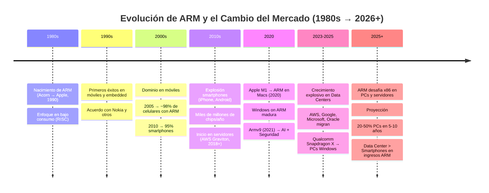

- =====================================

Autor: Estrada Rodríguez Melani

Materia: Lenguajes de Interfaz 

Grupo: SC6C

Fecha: 12/ Febrero /2026

Descripción: Investigación de los ARM y el cambio o posición actual en el mercado. 
- =====================================

# ARM en Laptops Modernas y el Cambio del Mercado Tradicional💻 

Los ARM (Avanced RISK Machine) son un tipo de procesador, estos se destacan por su unidad central de procesamiento (CPU), siendo mejores en su eficiencia energética y su rendimiento. 

Anteriormente estos procesadores eran utilizados en los dispositivos móviles, pero gracias a sus características sus aplicaciones en el rubro tecnológico se fueron expandiendo y ahora son utilizados en sistemas integrados, dispositivos de IoT, servidores y hasta supercomputadoras. 

>Su gran éxito se debe a que el ARM usa su procesamiento con conjuntos de instrucciones reducidos (RISC), este es el que le permite lograr un rendimiento por vatio, para lograr el menor consumo de energía posible. 

**Ejemplos aplicados**
* 2008, Google y Amazon, utilizan el procesador ARM al sentir la necesidad de reducir costos, a través del consumo energético de sus servidores, así como para el reconocimiento y procesamiento de imágenes, debido a su destacada eficiencia y rendimiento en
dichas aplicaciones. 
* 2020, Apple presentó su primer ordenador portátil de uso doméstico con ARM, este fue el MacBookAir con procesador M1, adquiriendo un buen rendimiento y eficiencia energética.

**Beneficios de los procesadores basados en Arm**
* Mayor eficiencia energética.
* Tamaño más pequeño y menor generación de calor.
* Uso versátil para diferentes tipos de tecnología.

## Desafíos de los Procesadores Basados en ARM
  
👾**Compatibilidad con software**
Si bien la compatibilidad aumenta cada vez, aún hay algunas aplicaciones que pueden no estar disponibles para los procesadores o arquitecturas de la ARM.

👾**Rendimiento para cargas de trabajo específicas**
Es posible que ciertos trabajos estén especializados para la arquitecturas x86 y aún tengan ventaja, pero con cada nueva generación de procesadores ARM, su ventaja vaya disminuyendo.

## ARM y el Cambio del mercado

**Ejemplo:**
*Arquitectura: ARM (Dominante) vs. RISC-V (Emergente)*
|Aspecto |ARM| RISC-V |
|--|--|--|
|**Posición en el mercado** | Arquitectura dominante, ampliamente establecida| Tecnología emergente, en rápido crecimiento|
|**Eficiencia energética**| Alta eficiencia energética| Buena eficiencia (depende de la implementación personalizada)|
|**Ecosistema**| Extenso y maduro: gran cantidad de herramientas, software y soporte| En desarrollo, pero creciendo rápidamente gracias al código abierto|
|**Disponibilidad de dispositivos**|Muy amplia: teléfonos inteligentes, tablets, IoT, servidores, automotriz, etc.| Muy amplia: teléfonos inteligentes, tablets, IoT, servidores, automotriz, etc.|
|**Naturaleza de la arquitectura**| Propietaria (licencias requeridas)| Código abierto (ISA libre, sin royalties ni licencias obligatorias)|
|**Innovación y personalización**| Buena, pero limitada por licencias y control centralizado| Muy alta: permite modificaciones y soluciones 100% personalizadas|
|**Costo / Rentabilidad**| Costos de licencia pueden ser altos| Muy atractiva: sin royalties, reduce costos significativamente|
|**Atractivo principal**| Ecosistema maduro, confiabilidad y optimización probada| Flexibilidad, bajo costo, innovación rápida y comunidad creciente|
|**Comunidad y adopción**| Muy grande y consolidada| En rápido crecimiento: universidades, startups, empresas explorando su potencial|

Con lo anterior mostrado, puede hacerse una idea de la posición de los ARM, estos siguen consolidados como una arquitectura dominante que sigue en constante crecimiento, con el enfoque en el rendimiento de los dispositivos y la duración de la batería.

El crecimiento en la popularidad de este tipo de procesador en el mercado de empresas como MediaTek y Samsung Electronics, está siendo impulsado por los avances en inteligencia artificial y procesadores de aprendizaje automático.

--------------------------
**Conclusión**

Para retomar lo aprendido los procesadores ARM tienen su origen en sistemas y algunos celulares, hasta convertirse en los procesadores más usados en el mercado tecnológico actual, gracias a que priorizan la eficiencia energética, el bajo consumo de energía y su buen rendimiento.
Este procesador ha seguido luchando por el dominio de la arquitectura en el mercado hasta utilizarse principalmente en Intel y AMD.

Algunos de los aparatos tecnológicos donde más se usan son en smartphones, dispositivos IoT, en servidores y otros más, esto se debe a que las empresas buscan soluciones ARM personalizadas, impulsadas por la demanda de IA, machine learning y reducción de costos energéticos. los avances en Windows on ARM han permitido que el ARM alcance el mercado de los portátiles, acercándose aún más a competidores como AMD.

Para finalizar siguen habiendo arquitecturas emergentes como  RISC-V, aunque aún el ARM mantiene una ventaja, lo que puede confirmar que el ARM seguirá estando en el mercado, buscando la evolución de los dispositivos y sistemas informáticos durante algún tiempo más.

**Bibliografias:**
* [Google Cloud. (s. f.). ¿Qué son los procesadores basados en ARM?](https://cloud.google.com/discover/what-are-arm-based-processors?hl=es-419)

* [Universidad de La Laguna. (2023). Análisis de eficiencia energética en procesadores ARM Repositorio Institucional Universidad de La Laguna.](https://riull.ull.es/xmlui/handle/915/33502) 

* [Market Research Future. (2026). _Next Generation Processors Market.](https://www.marketresearchfuture.com/es/reports/next-generation-processors-market-38640)

