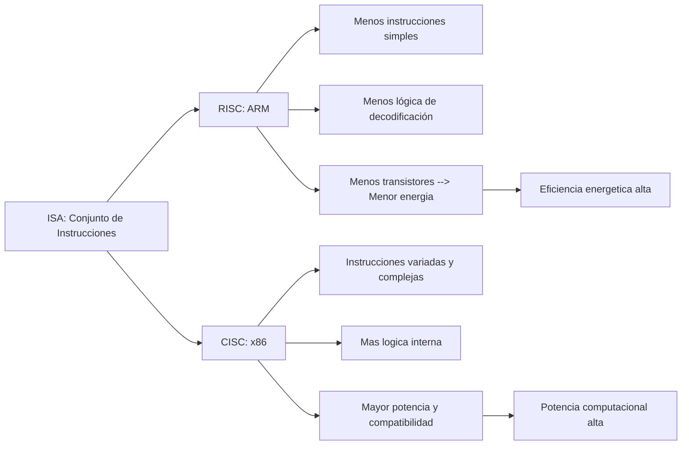

**Nombre: Barajas Mercado Rosa Isela** 

**Numero de control: 23212548**

**Clase: Lenguajes de Interfaz 3 pm**

---

# ⚡ ARM vs x86: eficiencia energética como ventaja estratégica

## 📌 1. ¿Qué son ARM y x86?

Antes que nada, es importante entender qué significan estos términos:

- ***ARM (Advanced RISC Machine)***: arquitectura de tipo RISC — Reduced Instruction Set Computing (conjunto reducido de instrucciones), diseñada para ser simple y eficiente energéticamente.

- ***x86***: arquitectura de tipo CISC — Complex Instruction Set Computing (instrucciones complejas), usada tradicionalmente en computadoras de escritorio y servidores por su potencia y compatibilidad histórica.

---

## ⚡ 2. ¿Por qué ARM suele ser más eficiente energéticamente?

La eficiencia energética depende de varios factores de diseño:

### 🧠 Comparación general
| Característica | ARM (RISC) | x86 (CISC) |
|--------------|------------|------------|
| Filosofía de diseño | Instrucciones simples y rápidas | Instrucciones complejas y versátiles |
| Consumo energético | ⚡ Bajo ✨ | 🔋 Más alto |
| Complejidad del hardware | 🧩 Menor | 🧠 Mayor |
| Ideal para | Móviles, IoT, servidores eficientes | PCs, estaciones de trabajo, servidores tradicionales |
| Ejemplos | Smartphones, Apple M1/M2 | Intel Core, AMD Ryzen |

---

## 🔍 3. Consumo de energía: cifras comparativas

Para ilustrar la diferencia en consumo energético, aquí un ejemplo típico en sistemas embebidos:
| Arquitectura | Ejemplo de SoC | Consumo en reposo | Consumo en carga |
|-------------|----------------|------------------|------------------|
| ARM | Rockchip RK3568 | 2–3 W | 6–8 W |
| ARM | NXP i.MX8M Plus | 2–4 W | 7–10 W |
| x86 | Intel Atom x6425E | 4–6 W | 10–15 W |
| x86 | AMD Ryzen V1605B | 6–8 W | 18–22 W |

➡️ En este escenario, los sistemas **ARM consumen aproximadamente 40 %–60 % menos energía** que sistemas x86 similares.

---

## 🧩 4. Diagrama: diferencias arquitectónicas

🧠 Explicación del diagrama:

- **ARM (RISC)** tiene instrucciones más simples y menos lógica interna, lo que reduce los transistores activos y el consumo energético.

- **x86 (CISC)** incluye instrucciones complejas que requieren más lógica de decodificación y potencia, pero pueden ser más eficientes en casos de alto rendimiento.

---

## 📈 5. ¿Por qué esto importa estratégicamente?

📌 **Ventajas estratégicas de ARM**

✅ ***Bajo consumo***: esencial para dispositivos móviles, IoT y servidores que buscan menor gasto energético.

✅ ***Menor calor producido***: reduce necesidad de ventilación o sistemas de refrigeración costosos.

✅ ***Ahorro en data centers***: escala de consumo energético baja implica costos operativos menores.

✅ ***Personalización***: fabricantes pueden licenciar y adaptar diseños ARM a medida.

⚠️ **Debate reciente**

Algunas empresas de x86 (por ejemplo AMD e Intel) argumentan que las nuevas **APUs x86 pueden igualar eficiencia energética** de ARM en ciertos segmentos, especialmente portátiles.
Esto significa que la ventaja de ARM **no es absoluta**, sino que depende del diseño, uso y generación de chips.

---

## 📊 6. Resumen de pros y contras

| Aspecto | ARM | x86 |
|--------|-----|-----|
| Eficiencia energética | ⭐⭐⭐⭐ | ⭐⭐ |
| Rendimiento máximo | ⭐⭐⭐ | ⭐⭐⭐⭐ |
| Software compatible | En crecimiento | Muy maduro |
| Costo de manufactura | Generalmente menor | Puede ser mayor |
| Uso típico | Móviles, IoT, servidores eficientes | PCs, servidores tradicionales |

---

# 📌 Conclusión

👉 **ARM ha sido tradicionalmente más eficiente energéticamente** gracias a su diseño simplificado RISC y técnicas avanzadas de gestión de energía.

👉 **x86 ha reducido parte de esa brecha energética** con nuevas generaciones de procesadores potentes.

👉 La elección entre uno y otro depende del **uso estratégico**:

- Para **baterías largas y menor gasto operativo**, ARM es muy atractivo.

- Para **compatibilidad de software madura y máximo rendimiento bruto**, x86 sigue siendo importante.

---
